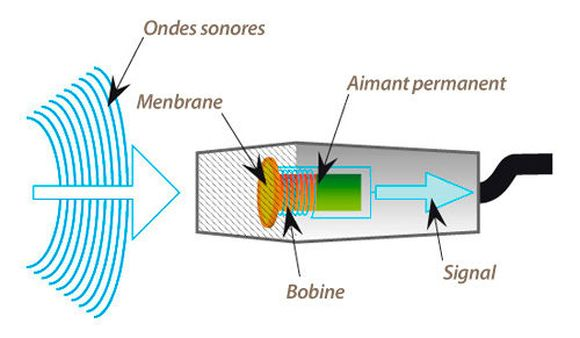
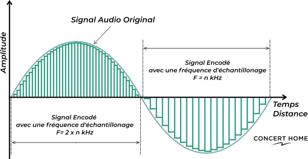

# Généralités et définitions 

## Rappels 

[Slides Conférence Audio](https://www.canva.com/design/DAGzQK78Egk/hJAKd-WQVrf9Hh7koyh8Rg/view?utm_content=DAGzQK78Egk&utm_campaign=designshare&utm_medium=link2&utm_source=uniquelinks&utlId=h8ee13cb124)

Le son est une vibration de l'air. 
Pour traduire cette vibration dans le domaine électronique, on utilise des transducteurs : microphone ou haut-parleur (c'est le même principe). 
Le microphone est doté d'une membrane devant un aimant, ce dernier étant entouré d'une bobine de cuivre. Le mouvement de la membrane fait varier le champ magnétique de l'aimant, induisant un mouvement des électrons dans la bobine de cuivre. En fin de bobine, on récupère deux fils : le signal électronique. 
Le haut-parleur fonctionne sur le principe inverse : on envoie un signal électronique (variation de tension) dans la bobine, ce qui induit une variation du champ magnétique de l'aimant, mettant alors en mouvement la membrane. Cette dernière fait vibrer l'air, produisant un signal acoustique. 

## Audio numérique

Pour passer dans le domaine numérique (donc discret) on doit échantillonner le signal, l'ordinateur ne pouvant pas traiter de signaux continus. 

1. Echantillonnage
Cette étape consiste à découper le signal en des échantillons (samples) discrets dans le temps, d'après le théorème de Nyquist-Shannon: 
> La représentation discrète d'un signal exige des échantillons régulièrement espacés à une fréquence d'échantillonnage supérieure au double de la fréquence maximale présente dans ce signal.
Si on ne respecte pas cette règle (fs > 2 * max_freq), on obtient de l'aliasing : une distortion numérique du signal. 
Cette règle est simple : il nous faut plus de deux échantillons pour représenter une onde (une oscillation d'onde étant représentée à minima par un état haut et un état bas). 
Dans l'audio : minimum 44 100Hz (norme CD), souvent 48 000Hz (plus facile à synchroniser avec la vidéo). 

2. Quantization / Quantification
Il s'agit de la résolution binaire de chaque échantillon. Historiquement 8 bits sur les vieilles consoles (arcades, gameboy etc), le son numérique s'est rapidement standardisé à 16 bits (norme CD). 
Aujourd'hui il est fréquent d'utiliser une quantization de 24 ou 32 bits (32bits étant le maximum de la plupart des cartes sons). 
Cette résolution est importante : elle définit le nombre pas sur lesquels on peut décrire l'amplitude des échantillons. 

3. Nombre de canaux / Entrelacés ou non
L'audio numérique est aussi caractérisé par un nombre de canaux (signaux). En général, quand on écoute au casque, on est en stéréo : 2 canaux. Mais il peut y en avoir plus (5.1 dolby : 6 canaux).

3. ADC DAC 
Analog-Digital Converter et Digital-Analog Converter. Ce sont les dispositifs qui permettent de convertir un signal analogique en numérique et vice-versa. Ce sont des convertisseurs intégrés aux cartes sons (que ce soit les cartes sons intégrées des cartes mères ou des cartes sons dédiées). 

4. Pilotes Audio 
Le kernel du système s'occupe des échanges de buffers audio avec la carte son. Il existe ensuite une ou plusieurs couches de drivers/API audio de plus haut niveau qui permettent l'échange avec les logiciels : ASIO, WASAPI, XAudio sur Windows, CoreAudio sur OSX, Alsa puis PulseAudio Jack & PipeWire sur Linux. 
Les cliens (logiciels) qui souhaitent accéder à l'audio entrant ou sortant doivent *souscrire* auprès d'un de ces pilotes (souvent le plus haut niveau possible) afin de recevoir les buffers audio entrants, et de pouvoir écrire dans ceux sortants. 
Souvent, les tailles de buffer hardware (échange kernel <> matériel) sont plus grands que ceux logiciel (échange client <> pilote). 

Historique : le fait pour plusieurs clients de souscrire à un driver audio en même temps est relativement récent. Jusqu'il y a peu (~15 ans), un logiciel utilisant l'audio bloquait tous les autres. 

