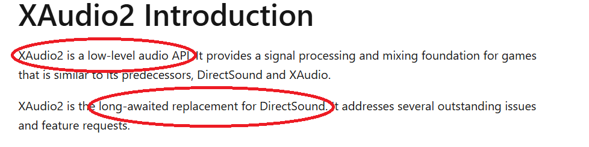
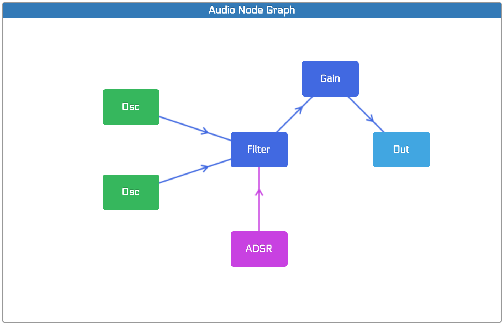
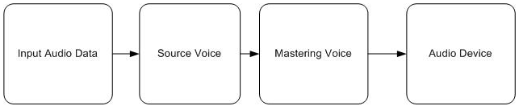

# XAudio2 - Realtime Audio Playback

## Rappel de ce à quoi ressemble un playback audio bas niveau 

``` cpp
// Cette fonction est appelée à chaque fois que le driver a besoin de n échantillons en sortie
void audio_callback(float **in, float **out, size_t n_samples, uint8_t in_channels, uint8_t out_channels)
{
    // Débrouille toi avec les échantillons entrant
    // Ecris ce que tu veux en sortie
}
```

Ceci n'existe pas dans XAudio2. 

## XAudio2 : un système de Graph audio  



Assez loin du bas niveau, XAudio2 est une API audio conçue comme un système de graph/node. 
Un système de graph peut être vu comme une chaîne de traitements audio complexe. 



Les features et concepts : 
- SourceVoice et CaptureVoice : source sonore (noeud de sortie) et capture sonore (noeud d'entrée)
- Effets audio 
- Mixage > combiner plusieurs "sons" dans un flux unique 
- Support multicanal 
- Multirate (plusieurs graphs avec des sample rate différents)
- Non-bloquant : il gère les threads à votre place 

Développé avec comme principale target le jeu vidéo, ça semble adapté pour ce module ! 

Le graph XAudio2 : 


Le graph peut-être contrôlé en temps-réel, pendant qu'il est en cours d'exécution : création et destruction de voix, routing, modification des effets et du graph, changer des paramètres...

## Les mécanismes de base XAudio2 

Les briques de base : 
- `IXAudio2SourceVoice` : un son 
- `IXAudio2MasteringVoice` : le "mastering" (la sortie audio)


Pour simplement lire un buffer audio, voici le code : 
``` cpp

#include <Windows.h>
#include <xaudio2.h>
#include <vector>
#include <iostream>
#include <cmath>

int main() {
    // Initialisation COM
    HRESULT hr = CoInitializeEx(nullptr, COINIT_MULTITHREADED);
    if (FAILED(hr)) return hr;

    // On créé l'instance de XAudio2 
    IXAudio2* xaudio2 = nullptr;
    hr = XAudio2Create(&xaudio2, 0, XAUDIO2_DEFAULT_PROCESSOR);
    if (FAILED(hr)) return hr;

    // On créé la voix master : elle start Xaudio2 automatiquement (on n'appelle pas xaudio2->Start())
    IXAudio2MasteringVoice* master_voice = nullptr;
    hr = xaudio2->CreateMasteringVoice(&master_voice);
    if (FAILED(hr)) return hr;

    // On créé un WAVEFORMATEX (similaire à la structure d'un fichier WAVE, qui inclut en puissance le Broadcast extension format)
    // Attention WAVEFORMAT (sans EX) est XAUDIO1 (non rétrocompatible)
    WAVEFORMATEX wfx = {};
    wfx.wFormatTag = WAVE_FORMAT_IEEE_FLOAT;
    wfx.nChannels = 1;
    wfx.nSamplesPerSec = 48000;
    wfx.wBitsPerSample = 32;
    wfx.nBlockAlign = wfx.nChannels * (wfx.wBitsPerSample / 8);
    wfx.nAvgBytesPerSec = wfx.nSamplesPerSec * wfx.nBlockAlign;

    // Source voice = un lecteur de buffer audio / playback
    IXAudio2SourceVoice* source_voice = nullptr;
    hr = xaudio2->CreateSourceVoice(&source_voice, &wfx);
    if (FAILED(hr)) return hr;

    // Oscillateur sinusoidal 
    std::vector<float> audio_buffer(wfx.nSamplesPerSec * 5);
    const float freq = 440.0f;
    for (size_t i = 0; i < audio_buffer.size(); ++i) {
        audio_buffer[i] = sinf(2.0f * 3.14159265f * freq * (float)i / wfx.nSamplesPerSec);
    }

    // La structure buffer XAudio2 : on lui donne notre buffer + quelques infos
    XAUDIO2_BUFFER buf = {};
    buf.pAudioData = reinterpret_cast<BYTE*>(audio_buffer.data());
    buf.AudioBytes = audio_buffer.size() * sizeof(float);
    buf.Flags = XAUDIO2_END_OF_STREAM;

    // On donne le buffer à la source 
    source_voice->SubmitSourceBuffer(&buf);

    // Et c'est parti ! 
    source_voice->Start();

    while (true) {
        XAUDIO2_VOICE_STATE state;
        source_voice->GetState(&state);
        if (state.BuffersQueued == 0) break;
        Sleep(100);
    }

    source_voice->DestroyVoice();
    master_voice->DestroyVoice();
    xaudio2->Release();
    CoUninitialize();
}


```


Un exemple avec une entrée audio : 
``` cpp 

```

La structure parent et toutes les fonctions utilitaires : [IXAudio2Voice](https://learn.microsoft.com/en-us/windows/win32/api/xaudio2/)

## Callbacks 

Les callbacks audio dans XAudio2, non-conformes aux pratiques standard de l'audionumérique, ne permettent pas de récupérer des informations particulièrement intéressantes (comme de l'audio par exemple). 
Elles pourraient, éventuellement, permettre de simuler un callback audio classique comme montré en début de ce chapitre 3. Ce ne serait cependant pas vraiment adapté au fonctionnement interne de XAudio2.  

``` cpp
// Interface 
class my_voice_callback : public IXAudio2VoiceCallback
{
    void OnBufferStart(void *pBufferContext) override; // Appelé quand une voix s'apprête à lire un buffer 
    void OnBufferEnd(void *pBufferContext) override; // Appelé quand une voix finit la lecture d'un buffer

    void OnStreamEnd() override; // Quand une voix finit un buffer XAUDIO2_BUFFER dont le XAUDIO2_END_OF_STREAM a été set 
    void OnLoopEnd(void *pBufferContext) override; // Quand une voix atteint le point de fin de boucle 
    
    void OnVoiceError(void *pBufferContext, HRESULT error) override; // Une erreur ? 

    void OnProcessingPassStart(UINT32 BytesRequired) override; // Juste avant que XAudio lise les data du buffer d'une voix  
    void OnProcessingPassEnd() override; // Après un "processing pass" (?)
};

```

## Mécanismes de graph 

Le mécanisme de graph permet de router des voix (sources ou captures) vers des voix de submix. Ca peut avoir plusieurs intérêt : 
- Mixer des voix avant le mastering final ()
- Appliquer un effet à un ensemble de voix (en une seule manipulation / minimisant le coût processeur)
- Conversion de format avant le mastering 

Le submix est le mécanisme principal du routing "passthrough". 
On peut évidemment router des submix dans d'autres submix (tant que leur ProcessingStage est identique). 
 
XAUDIO2_VOICE_SENDS
``` cpp
typedef struct XAUDIO2_VOICE_SENDS {
  UINT32                  SendCount; // Le nombre d'envois 
  XAUDIO2_SEND_DESCRIPTOR *pSends; // Les pointeurs décrivant les envois 
} XAUDIO2_VOICE_SENDS;

typedef struct XAUDIO2_SEND_DESCRIPTOR {
  UINT32        Flags;  // 0 ou XAUDIO2_SEND_USEFILTER
  IXAudio2Voice *pOutputVoice; // Voix de sortie 
} XAUDIO2_SEND_DESCRIPTOR;
```

Ce qu'on passe comme "voix" de send, c'est une SubmixVoice, définie par : 
``` cpp
HRESULT CreateSubmixVoice(
  IXAudio2SubmixVoice        **ppSubmixVoice, 
  UINT32                     InputChannels, // nombre d'entrées 
  UINT32                     InputSampleRate, // Sample rate d'entrée ! 
  UINT32                     Flags, // Comme SEND DESCRIPTOR 
  UINT32                     ProcessingStage, // Une sorte de "priorité" des voix submix entre-elles 
  const XAUDIO2_VOICE_SENDS  *pSendList,
  const XAUDIO2_EFFECT_CHAIN *pEffectChain
);

// Pour passer les voix de sortie, on utilise : 
HRESULT SetOutputVoices(
  [in] const XAUDIO2_VOICE_SENDS *pSendList
);
```

## Les Effets & effects chains

Les effets sont l'autre modalité du "passthrough" dans XAudio2. 
Mais cette fois, et pour la première fois depuis qu'on a commencé à regarder XAudio2 : On peut manipuler les buffers entrant, et fournir un buffer en sortie (cf. Le callback audio de base).

XAudio nous fournit une réverb, et un getter de volume. 
[Effect & chains](https://learn.microsoft.com/en-us/windows/win32/xaudio2/xaudio2-audio-effects)

XAPOFX nous fournit d'autres choses, soit 4 effets (echo, EQ, Limiter, Reverb)
[XAPO Effects](https://learn.microsoft.com/en-us/windows/win32/xaudio2/xapofx-overview)

Les effets doivent être instanciés, puis passés à une structure descripteur, puis dans une effect chain. 
La effect chain est ensuite passée à une voix. 

``` cpp 
    //IUnknown* myecho;
    IUnknown *effect;
    HRESULT hr = XAudio2CreateReverb(&effect, 0);

    XAUDIO2_EFFECT_DESCRIPTOR descriptor;
    descriptor.InitialState = true;
    descriptor.OutputChannels = 2;
    descriptor.pEffect = myeffect;

    XAUDIO2_EFFECT_CHAIN chain;
    chain.EffectCount = 1;
    chain.pEffectDescriptors = &descriptor;

    // Plus tard, avant d'appeler Start : 
    source_voice->SetEffectChain(&chain);
    source_voice->EnableEffect(0); // 0 est l'index de l'effet dans la chaîne, pas nécessaire puisque son initialstate est true 

    // Puis à la fin de la performance audio 
    myeffect->Release(); // Pour appeler le destructeur 
```

[Un exemple microsoft](https://learn.microsoft.com/en-us/windows/win32/xaudio2/how-to--create-an-effect-chain)

### Custom effet : XAPO Xaudio2 Processing Object 

[XAPO](https://learn.microsoft.com/en-us/windows/win32/xaudio2/xapo-overview)
[Doc Git](https://github.com/MicrosoftDocs/win32/blob/docs/desktop-src/xaudio2/how-to--create-an-xapo.md)

``` cpp 

#pragma once
#include <xaudio2.h>
#include <xapo.h>
#include <xapobase.h>
#include <iostream>
#include <cassert>

// Il est nécessaire d'importer XAPOBase.lib
#pragma comment(lib, "XAPOBase.lib")

// On hérite de CXAPOBase, et on doit avoir un uid unique 
// Il existe un outil dans Visual Studio pour en générer (Create GUID)
class __declspec(uuid("268EE84D-F9BF-4DEE-92E3-47B3463F7028")) echo : public CXAPOBase
{

    struct echo_t
    {
        size_t size = 0; 
        size_t read_pos = 1, write_pos = 0;
        float* buffer = nullptr;
    };

    WAVEFORMATEX fmt;
    echo_t echoes[2];

    // Feedback [0.0, 1.0] taux de réinjection de l'écho (combien de temps ça va se répéter)
    // Mix [0.0, 1.0] mixage entre signal normal et signal traité (0 = son normal, 1 = 100% son traité)
    float feedback, mix; 
    
public:
    // Cette structure définit les propriétés de l'effet 
    static constexpr XAPO_REGISTRATION_PROPERTIES EchoEffectProperties{
        __uuidof(echo), // GUID unique
        L"echo",        // Nom
        L"Custom echo", // Description
        0, 0, // versions
        XAPO_FLAG_FRAMERATE_MUST_MATCH, // Un flag
        1, 2, // nombre min max d'entrées 
        1, 2,  // Nombre min max de sorties
    };

    echo() : CXAPOBase(&EchoEffectProperties)
        , feedback(0.9f)
        , mix(0.5f)
    {}

    ~echo()
    {}

    // Optionnel - vérification 
    STDMETHOD(IsInputFormatSupported)(
        const WAVEFORMATEX* pOutputFormat,
        const WAVEFORMATEX* pRequestedInputFormat,
        WAVEFORMATEX** ppSupportedInputFormat) override
    {
        // Accept 32-bit float, stereo, matching sample rate
        if (pRequestedInputFormat->wFormatTag == WAVE_FORMAT_IEEE_FLOAT &&
            pRequestedInputFormat->nChannels == 2 &&
            (!pOutputFormat || pRequestedInputFormat->nSamplesPerSec == pOutputFormat->nSamplesPerSec))
        {
            *ppSupportedInputFormat = const_cast<WAVEFORMATEX*>(pRequestedInputFormat);
            return S_OK;
        }
        return E_INVALIDARG;
    }

    // Optionnel - vérification 
    STDMETHOD(IsOutputFormatSupported)(
        const WAVEFORMATEX* pInputFormat,
        const WAVEFORMATEX* pRequestedOutputFormat,
        WAVEFORMATEX** ppSupportedOutputFormat) override
    {
        if (pRequestedOutputFormat->wFormatTag == WAVE_FORMAT_IEEE_FLOAT &&
            pRequestedOutputFormat->nChannels == 2 &&
            pRequestedOutputFormat->nSamplesPerSec == pInputFormat->nSamplesPerSec)
        {
            *ppSupportedOutputFormat = const_cast<WAVEFORMATEX*>(pRequestedOutputFormat);
            return S_OK;
        }
        return E_INVALIDARG;
    }

    // Nécessaire : initialisation 
    STDMETHOD(LockForProcess) (UINT32 InputLockedParameterCount,
        const XAPO_LOCKFORPROCESS_BUFFER_PARAMETERS* pInputLockedParameters,
        UINT32 OutputLockedParameterCount,
        const XAPO_LOCKFORPROCESS_BUFFER_PARAMETERS* pOutputLockedParameters)
    {
        assert(!IsLocked());
        assert(InputLockedParameterCount == 1);
        assert(OutputLockedParameterCount == 1);
        assert(pInputLockedParameters != NULL);
        assert(pOutputLockedParameters != NULL);
        assert(pInputLockedParameters[0].pFormat != NULL);
        assert(pOutputLockedParameters[0].pFormat != NULL);

        fmt = *pInputLockedParameters[0].pFormat;
        // buffer d'écho de 1/4 de seconde 
        for (size_t i = 0; i < fmt.nChannels; ++i)
        {
            echoes[i].size = fmt.nSamplesPerSec / 4;
            echoes[i].buffer = (float*)std::calloc(fmt.nSamplesPerSec / 4, sizeof(float));
        }

        return CXAPOBase::LockForProcess(
            InputLockedParameterCount,
            pInputLockedParameters,
            OutputLockedParameterCount,
            pOutputLockedParameters
        );
    }

    // Nécessaire : fonction appelée pour calculer les échantillons de sortie à partir de ceux en entrée 
    STDMETHOD_(void, Process)(UINT32 InputProcessParameterCount,
        const XAPO_PROCESS_BUFFER_PARAMETERS* pInputProcessParameters,
        UINT32 OutputProcessParameterCount,
        XAPO_PROCESS_BUFFER_PARAMETERS* pOutputProcessParameters,
        BOOL IsEnabled)
    {
        assert(IsLocked());
        assert(InputProcessParameterCount == 1);
        assert(OutputProcessParameterCount == 1);
        assert(NULL != pInputProcessParameters);
        assert(NULL != pOutputProcessParameters);

        XAPO_BUFFER_FLAGS inFlags = pInputProcessParameters[0].BufferFlags;
        XAPO_BUFFER_FLAGS outFlags = pOutputProcessParameters[0].BufferFlags;

        // assert buffer flags are legitimate
        assert(inFlags == XAPO_BUFFER_VALID || inFlags == XAPO_BUFFER_SILENT);
        assert(outFlags == XAPO_BUFFER_VALID || outFlags == XAPO_BUFFER_SILENT);

        // check input APO_BUFFER_FLAGS
        switch (inFlags)
        {
        case XAPO_BUFFER_VALID:
        {
            float* pvSrc = (float*)pInputProcessParameters[0].pBuffer;
            assert(pvSrc != NULL);

            float* pvDst = (float*)pOutputProcessParameters[0].pBuffer;
            assert(pvDst != NULL);

            // Audio loop 
            for (size_t ch = 0; ch < fmt.nChannels; ++ch)
            {
                for (size_t n = 0; n < pInputProcessParameters[0].ValidFrameCount; ++n)
                {
                    size_t index = n * fmt.nChannels + ch;
                    pvDst[index] = (pvSrc[index] * mix) + (echoes[ch].buffer[echoes[ch].read_pos] * (1.0f - mix) );
                    echoes[ch].read_pos = (echoes[ch].read_pos + 1) % echoes[ch].size;
                    echoes[ch].buffer[echoes[ch].write_pos] = (echoes[ch].buffer[echoes[ch].write_pos] * feedback) + pvSrc[index] ;
                    echoes[ch].write_pos = (echoes[ch].write_pos + 1) % echoes[ch].size;
                }
            }

            break;
        }

        case XAPO_BUFFER_SILENT:
        {
            // All that needs to be done for this case is setting the
            // output buffer flag to XAPO_BUFFER_SILENT which is done below.
            break;
        }

        }

        // set destination valid frame count, and buffer flags
        pOutputProcessParameters[0].ValidFrameCount = pInputProcessParameters[0].ValidFrameCount; // set destination frame count same as source
        pOutputProcessParameters[0].BufferFlags = pInputProcessParameters[0].BufferFlags;     // set destination buffer flags same as source
    }
};

``` 


L'instanciation de l'effet est similaire aux effets natifs, sauf la construction : 
``` cpp
IXAPO* effect = new echo();

XAUDIO2_EFFECT_DESCRIPTOR descriptor;
descriptor.InitialState = true;
descriptor.OutputChannels = 2;
descriptor.pEffect = myeffect;

XAUDIO2_EFFECT_CHAIN chain;
chain.EffectCount = 1;
chain.pEffectDescriptors = &descriptor;
```

## L'espace : X3DAudio 

Utilisé en combinaison avec XAudio2, X3DAudio permet de créer de la spatialisation. 
Il utilise les concepts suivants : 
- Emetteur : un point dans l'espace produisant du son 
- Ecouteur : Position à laquelle le son est entendu 

[X3DAudio](https://learn.microsoft.com/en-us/windows/win32/xaudio2/x3daudio-overview)
[Guide](https://learn.microsoft.com/en-us/windows/win32/xaudio2/how-to--integrate-x3daudio-with-xaudio2)

# Exercice : 

Réaliser un player de fichiers WAVE (parsés par vos soins) en ligne de commande : 
1. Parser avec votre parser, puis jouer l'audio avec XAudio2 
2. Jouer à partir d'un moment dans le fichier (exprimé en frames, ms ou secondes)
3. Ajouter des effets =) 
4. Créer un effet à vous (Custom effect)
